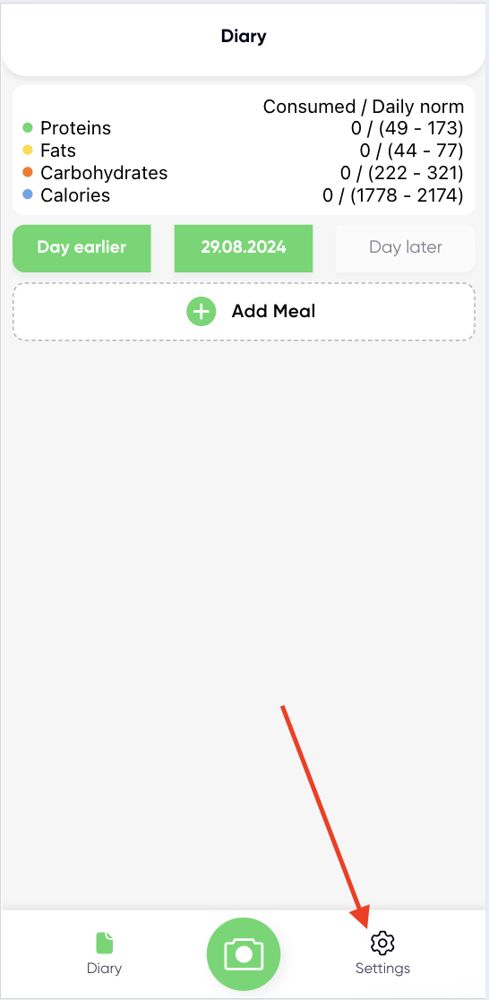
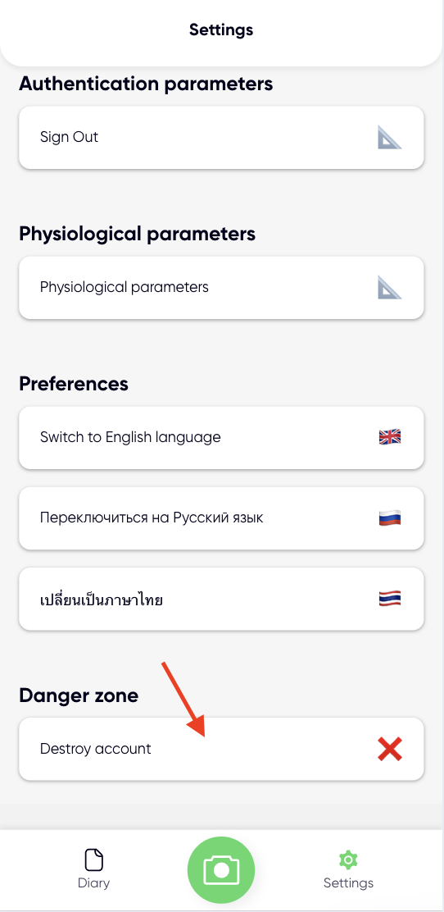

# Request Account Deletion in MealUp

If you want to delete your account in the MealUp application and related data, you can do this:

1) Go to Settings:

2) Press the "Destroy Account" button at the very bottom of the screen:

